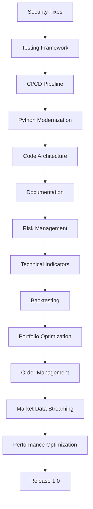

# Implementation Roadmap for quant_toolkit Modernization

## Executive Summary
This roadmap provides a structured approach to modernizing quant_toolkit, balancing quick wins with long-term architectural improvements. The plan is divided into phases with clear deliverables and dependencies.

## Overall Timeline: 6 Months

### Month 1: Foundation & Security
### Month 2: Core Modernization
### Month 3: Testing & Quality
### Month 4: New Core Features
### Month 5: Advanced Features
### Month 6: Polish & Documentation

---

## Phase 1: Critical Security & Foundation (Weeks 1-2)

### Week 1: Security Fixes
**Priority: CRITICAL**

#### Tasks:
1. **Fix SQL Injection Vulnerabilities**
   ```python
   # File: data_API.py
   # Replace all f-string queries with parameterized queries
   # Add input validation for all user inputs
   ```

2. **Create Security Validation Module**
   ```python
   # New file: src/quant_toolkit/validators.py
   # Implement symbol validation, date validation, SQL sanitization
   ```

3. **Remove Hardcoded Paths**
   ```python
   # Create config/settings.py
   # Move all hardcoded paths to configuration
   ```

#### Deliverables:
- [ ] All SQL queries parameterized
- [ ] Input validation implemented
- [ ] Configuration system in place

### Week 2: Testing Infrastructure
**Priority: HIGH**

#### Tasks:
1. **Set Up pytest Framework**
   ```bash
   # Update pyproject.toml with test dependencies
   # Create tests/ directory structure
   # Write first 10 unit tests for critical functions
   ```

2. **Create Test Fixtures**
   ```python
   # tests/fixtures/sample_data.py
   # Mock database, sample time series data
   ```

3. **CI/CD Pipeline Setup**
   ```yaml
   # .github/workflows/ci.yml
   # Automated testing, linting, security checks
   ```

#### Deliverables:
- [ ] pytest configured and running
- [ ] Initial test suite (20% coverage)
- [ ] CI/CD pipeline active

---

## Phase 2: Python Modernization (Weeks 3-4)

### Week 3: Type Hints & Modern Syntax
**Priority: MEDIUM**

#### Tasks:
1. **Modernize Type Hints**
   - Replace `Union[x, y]` with `x | y` syntax
   - Add missing type hints
   - Configure mypy

2. **Update Python Idioms**
   - Convert to f-strings
   - Use pathlib consistently
   - Replace type() with isinstance()

#### Deliverables:
- [ ] All type hints modernized
- [ ] mypy passing with strict mode
- [ ] Modern Python syntax throughout

### Week 4: Code Architecture Improvements
**Priority: MEDIUM**

#### Tasks:
1. **Convert to Dataclasses**
   ```python
   # Convert DBPaths and configuration classes
   # Add validation in __post_init__
   ```

2. **Implement Context Managers**
   ```python
   # Database connection context managers
   # Resource cleanup patterns
   ```

3. **Add Enum Classes**
   ```python
   # Replace string constants with Enums
   # WEEKDAY_MAP, MONTH_KEY_MAP, etc.
   ```

#### Deliverables:
- [ ] Key classes converted to dataclasses
- [ ] Proper resource management
- [ ] Constants replaced with Enums

---

## Phase 3: Engineering Best Practices (Weeks 5-8)

### Weeks 5-6: Comprehensive Testing
**Priority: HIGH**

#### Tasks:
1. **Unit Test Coverage**
   - Target: 80% coverage
   - Mock all external dependencies
   - Test edge cases and error conditions

2. **Integration Tests**
   - Database operations
   - Date calculations with holidays
   - End-to-end workflows

3. **Performance Tests**
   - Benchmark critical functions
   - Memory usage profiling

#### Deliverables:
- [ ] 80% test coverage achieved
- [ ] All modules have test files
- [ ] Performance baselines established

### Weeks 7-8: Documentation & Logging
**Priority: MEDIUM**

#### Tasks:
1. **Structured Logging**
   ```python
   # Implement centralized logging
   # Replace all print statements
   # Add debug/info/warning/error levels
   ```

2. **API Documentation**
   - Add Google-style docstrings
   - Set up Sphinx
   - Generate HTML docs

3. **Example Notebooks**
   - Basic usage examples
   - Common workflows
   - Best practices guide

#### Deliverables:
- [ ] All public APIs documented
- [ ] Logging implemented throughout
- [ ] 5+ example notebooks

---

## Phase 4: Core Feature Development (Weeks 9-12)

### Weeks 9-10: Risk Management Module
**Priority: HIGH**

#### Implementation:
```python
# src/quant_toolkit/risk_management.py
- VaR calculation (Historical, Parametric)
- CVaR/Expected Shortfall
- Risk metrics (Sharpe, Sortino, Calmar)
- Maximum drawdown analysis
- Portfolio risk attribution
```

#### Tests:
- Unit tests for each risk metric
- Validation against known results
- Performance benchmarks

### Weeks 11-12: Technical Indicators
**Priority: HIGH**

#### Implementation:
```python
# src/quant_toolkit/technical_indicators.py
- Moving averages (SMA, EMA, WMA)
- Momentum indicators (RSI, MACD)
- Volatility indicators (BB, ATR)
- Volume indicators (OBV, VWAP)
```

#### Integration:
- Integrate with existing data_API
- Add streaming calculation support
- Create indicator combination framework

---

## Phase 5: Advanced Features (Weeks 13-20)

### Weeks 13-14: Backtesting Framework
**Priority: MEDIUM**

#### Core Components:
```python
# src/quant_toolkit/backtesting/
- Event-driven engine
- Strategy base class
- Performance analytics
- Transaction cost modeling
```

### Weeks 15-16: Portfolio Optimization
**Priority: MEDIUM**

#### Implementation:
```python
# src/quant_toolkit/portfolio_optimization.py
- Mean-variance optimization
- Risk parity
- Black-Litterman model
- Efficient frontier generation
```

### Weeks 17-18: Order Management System
**Priority: LOW**

#### Features:
- Order types and lifecycle
- Position tracking
- P&L calculation
- Risk checks

### Weeks 19-20: Market Data Streaming
**Priority: LOW**

#### Implementation:
- WebSocket connections
- Real-time data normalization
- Tick data aggregation
- Multiple broker support

---

## Phase 6: Polish & Release (Weeks 21-24)

### Week 21-22: Performance Optimization
- Profile and optimize hot paths
- Implement caching where beneficial
- Async/await for I/O operations
- Memory usage optimization

### Week 23: Security Audit
- Final security review
- Penetration testing
- Dependency vulnerability scan
- Security documentation

### Week 24: Release Preparation
- Version 1.0 release notes
- Migration guide
- Performance benchmarks
- Community documentation

---

## Quick Wins (Can be done anytime)

1. **Add .gitignore entries** (5 minutes)
2. **Fix obvious typos** (30 minutes)
3. **Add __version__ to __init__.py** (10 minutes)
4. **Create CHANGELOG.md** (30 minutes)
5. **Add LICENSE file** (5 minutes)
6. **Update README with badges** (20 minutes)
7. **Add pre-commit hooks** (1 hour)
8. **Configure ruff settings** (30 minutes)

---

## Resource Requirements

### Development Team
- **Weeks 1-8**: 1 developer (foundation work)
- **Weeks 9-20**: 2-3 developers (feature development)
- **Weeks 21-24**: 1 developer + 1 QA engineer

### Tools & Services
- GitHub Actions (free tier sufficient)
- PyPI account for releases
- Documentation hosting (ReadTheDocs)
- Code coverage service (Codecov)

### External Dependencies
- Market data for testing (can use free Yahoo Finance)
- Mock broker APIs for testing
- Historical data for backtesting

---

## Risk Mitigation

### Technical Risks
1. **Breaking Changes**
   - Mitigation: Maintain backward compatibility layer
   - Create migration scripts

2. **Performance Regression**
   - Mitigation: Benchmark before/after each change
   - Profile critical paths

3. **Data Loss**
   - Mitigation: Comprehensive backup before migrations
   - Extensive testing of data operations

### Schedule Risks
1. **Scope Creep**
   - Mitigation: Strict phase boundaries
   - Feature freeze after Week 20

2. **Technical Debt**
   - Mitigation: Allocate 20% time for refactoring
   - Regular code reviews

---

## Success Metrics

### Phase 1-3 (Foundation)
- [ ] Zero security vulnerabilities
- [ ] 80% test coverage
- [ ] All code passes linting
- [ ] CI/CD pipeline < 10 min

### Phase 4-5 (Features)
- [ ] 5+ new modules implemented
- [ ] All features have tests
- [ ] Performance benchmarks met
- [ ] Documentation complete

### Phase 6 (Release)
- [ ] Version 1.0 released
- [ ] Zero critical bugs
- [ ] Community adoption (100+ downloads)
- [ ] Positive user feedback

---

## Next Steps

1. **Immediate Actions** (This Week):
   - Fix SQL injection vulnerabilities
   - Set up pytest framework
   - Create security validators

2. **Team Preparation**:
   - Code review process
   - Development environment setup
   - Communication channels

3. **Stakeholder Communication**:
   - Weekly progress updates
   - Monthly steering committee
   - Public roadmap on GitHub

---

## Appendix: Dependency Graph



This roadmap provides a clear path from the current state to a modern, production-ready quantitative finance toolkit. Each phase builds upon the previous one, ensuring a solid foundation for advanced features.